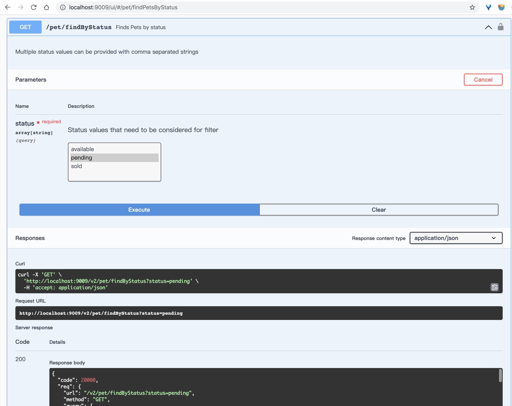
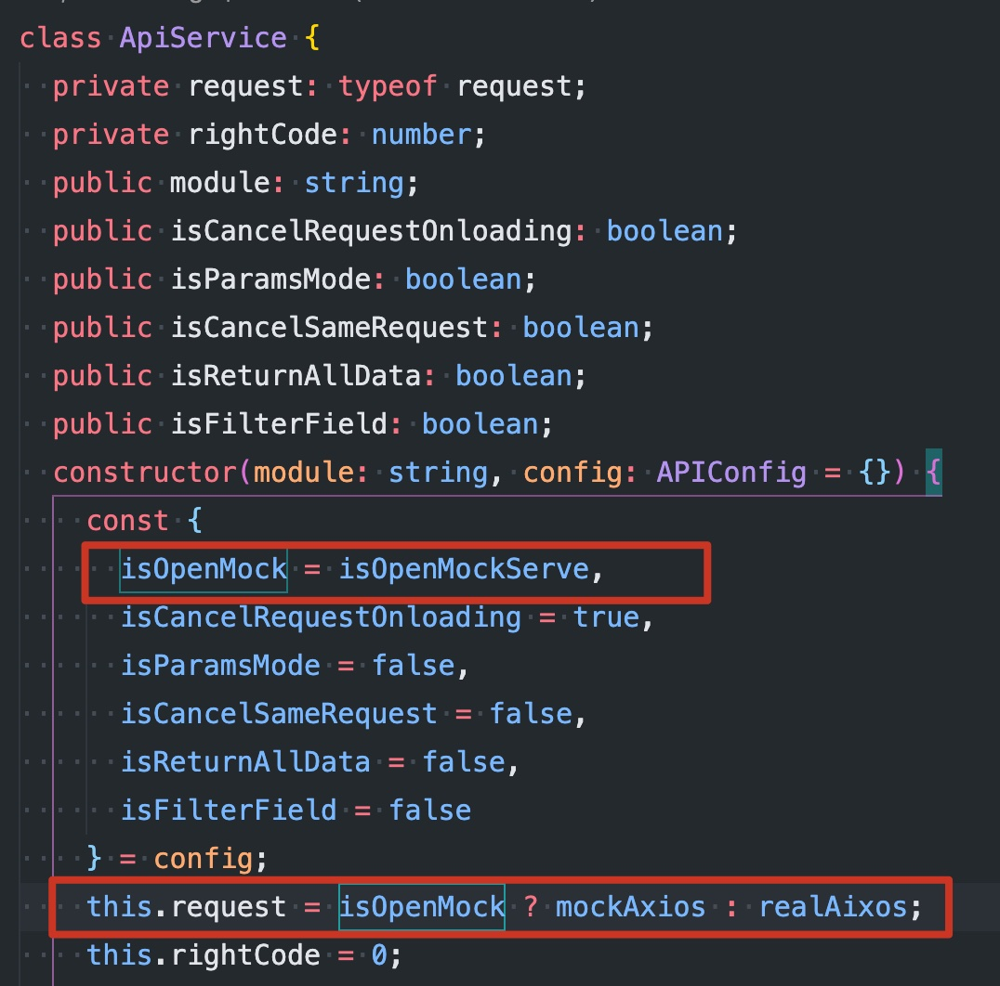

# Mock 数据服务工具

> 基于 `express`、`swagger config` 的 Mock 数据服务工具, 为对接接口的过程提供便利

[](https://badge.fury.io/js/mock-express-server)

[](https://travis-ci.com/jackluson/mock-express-server)
[](https://github.com/jackluson/mock-express-server/blob/master/LICENSE)

## 介绍 :jack_o_lantern:

根据 `swagger` 配置， 利用 `express` 动态创建生成 router(包括 route path、route handler)，在 route handler 中校验 req 中参数合理性，与利用[`faker.js`](https://github.com/Marak/Faker.js#readme) mock 数据返回 res

**基本原理:**

利用 `swagger` 的 path 生成对应的路由处理函数、path 下的 parameters 用来校验接口请求的参数、path 下面的 responses 用来 mock 接口返回接口参数，如果传参有误的话，则会返回具体错误详情。

目前只支持[swagger 2.0](https://swagger.io/docs/specification/2-0/what-is-swagger/) 规范配置 JSON 数据格式

## 快速开始

### 安装

via yarn

```shell
yarn global add mock-express-server
```

or npm

```shell
npm install -g mock-express-server

```

### 使用

- 全局命令方式

> Tip: `mock-express-server` 包的全局命令为：`mock-server`, 使用`mock-server --help`命令可查看命令使用说明，如图：


执行 start 命令即可启动 node 服务，如图：


执行 `mock-server help start` 查看更多选项使用，如图：


或者浏览器输入`http://localhost:9009/ui`，打开 swagger ui 测试接口即可，如图：


- 配置文件方式

在项目根目录下添加`mock.config.js` 文件，根据自己项目情况在 `mock.config.js` 中配置好 url 或者 localPath， 启动命令即可 `mock-server start` 命令即可（可结合 package.json， 配置在 script 中）

一个简单 demo 参考：[https://github.com/jackluson/mock-express-server-demo](https://github.com/jackluson/mock-express-server-demo)

## `mock.config.js` 配置项

> 无论是哪种方式使用，都是覆盖 mock-server 的默认值的，其默认值如下：

```js
const config = {
  port: 9009, // 启动端口
  copy: false, // 是否开始自动复制
  localPath: '', // 1. 本机绝对路径；2. 相对项目根目录路径（拼接`process.cwd()`）路径；（若是文件夹路径，则会遍历该文件夹下的所有文件 swagger 配置文件), 例如：'local/api-docs.json'
  tag: '', // 对应swagger config 的tags，空的话,则选择全部tags的path， 配置的话经过筛选后,只启动该tag下面的接口, 例如：/pet'
  url: 'https://petstore.swagger.io/v2/swagger.json', // swagger config 接口路径,例如：https://petstore.swagger.io/v2/swagger.json, 如果同时配置了url与localPath，合并两者，若有冲突，以url配置为止
  openLocalRedis: false, // 是否开始redis存储swagger 配置（一般用于开发阶段）
  openValidParams: false, // 是否检验请求参数类型合法，false，则不检验, 直接返回响应数据
  isHttps: false, //swagger-config.json是否返回https schemes，默认不是,设置true，主要是为了在codesandbox在线ide中使用
  redirectPath: 'ui', // 根路径`/`重定向地址，默认重定向到`/ui`
  codeMap: {
    success: 20000, // 成功逻辑code
    unlogin: 40001, // 没有登录
    parameterError: 40003, //参数错误
  },
};
```

### 配置文件属性

> 优先级：命令行输入 > 用户自定义配置文件 > 默认配置文件； `Object.assign(config, userConfig, option);`

|      name       |  type   | default                                                   |                                                                                                       description                                                                                                        |
| :-------------: | :-----: | :-------------------------------------------------------- | :----------------------------------------------------------------------------------------------------------------------------------------------------------------------------------------------------------------------: |
|      port       | number  | 9009                                                      |                                                                                                    mock server 端口号                                                                                                    |
|    localPath    | string  | ''                                                        |                                           1. 本机绝对路径；2. 相对项目根目录路径（拼接`process.cwd()`）路径；（若是文件夹路径，则会遍历该文件夹下的所有文件 swagger 配置文件)                                            |
|       tag       | string  | ''                                                        |                                                  对应 swagger config 的 tags，空的话,则选择全部 tags 的 path， 配置的话经过筛选后,只启动该 tag 下面的接口, 例如：/pet'                                                   |
|       url       | string  | ''                                                        | swagger config 数据源 url，目前只支持 Swagger 2.0。如 [https://petstore.swagger.io/v2/swagger.json](https://petstore.swagger.io/v2/swagger.json)， 如果同时配置了 url 与 localPath， 合并两者，若有冲突，以 url 配置为止 |
|  redirectPath   | string  | 'ui'                                                      |                                                                                          根路径`/`重定向地址，默认重定向到`/ui`                                                                                          |
| openLocalRedis  | boolean | false                                                     |                                                                                 是否开启 redis 存储 swagger 配置（一般用于开发调试阶段）                                                                                 |
|     isHttps     | boolean | false                                                     |                                                         swagger-config.json 是否返回 https schemes，默认不是,设置 true，主要是为了在 codesandbox 在线 ide 中使用                                                         |
| openValidParams | boolean | false                                                     |                                                                              是否检验请求参数类型合法，为 false，则不检验, 直接返回响应数据                                                                              |
|     codeMap     | object  | { success: 20000, unlogin: 40001, parameterError: 40003 } |                                                                                               成功,错误等状态码 Code 映射                                                                                                |

#### 子属性

- codeMap

|      name      |  type  | default |  description  |
| :------------: | :----: | :-----: | :-----------: |
|    success     | number |  20000  | 请求正确 code |
|    unlogin     | number |  40001  | 登录失效 code |
| parameterError | number |  40003  | 传参错误 code |

## 辅助 route

> 以下都是 get 请求

- `/ui` -- 打开当前 swagger 配置的 swagger ui 站点
- `/swagger-config.json` -- 获取当前 swagger 配置
- `readme` -- 解析当前 readme 文件，展示出来

## 结合实际 web 项目使用

在实际项目中，以请求库用 axios 为例，封装两个 axios 示例类，一个是真实的请求，一个是 mockAxios，通过变量去控制用哪个 axios 类，类似如下：


抽离出 service 层，new 时传入变量控制是否使用 mockAxios， 还可以通过设置 package.json 的 script，启动项目服务时传了对应的全局环境变量，设置默认值，例如：`const isOpenMockServe = process.env.MOCK_OPEN;`

## 二次开发

如果当前属性配置，满足不了你实际项目需要，可以 fork 出来，根据自己实际请求来，用 typescript 开发，开发环境用`ts-node-dev`自动刷新，安装好相关包，启动`start`命令即可

## TODO

1. 参数中文件类型校验还没处理
2. routers 相关代码待整理

## 最后

最后欢迎 star，fork，提 pr。
