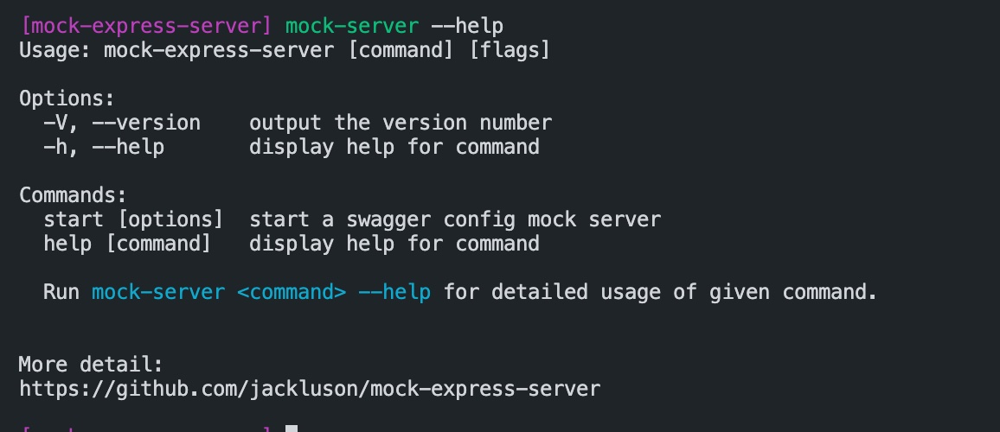
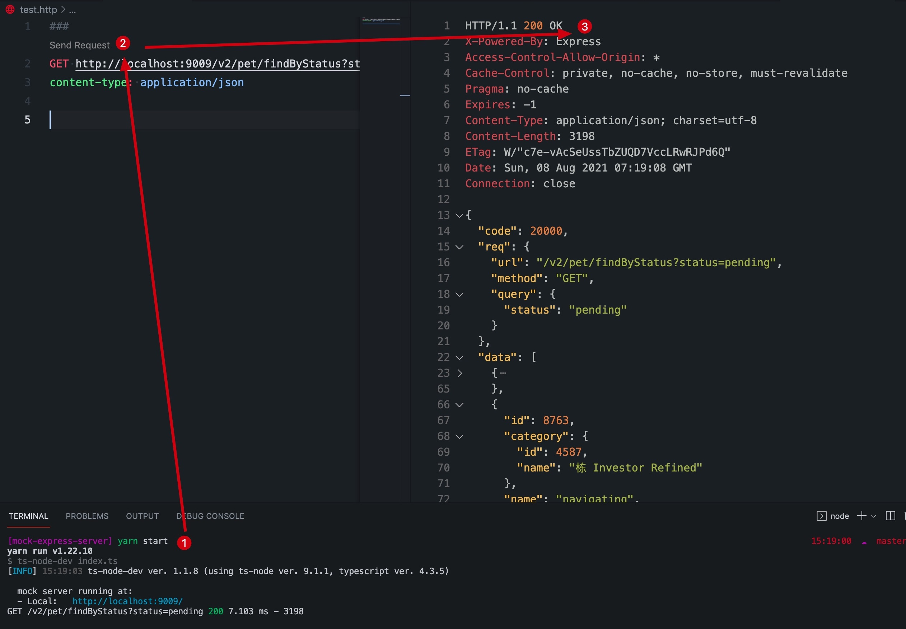
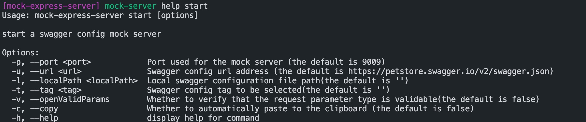

# 前端 Mock 数据服务工具

> 基于 `express`、`swagger` 的 Mock 数据服务工具, 为对接接口的过程提供便利

## 介绍 :jack_o_lantern:

根据 `swagger` 配置， 利用 `express` 动态创建生成 router(包括 route path、route handler)，在 route handler 中校验 req 中参数合理性，与利用`faker` mock 数据放回 res

**基本原理：**

利用 `swagger` 的 path 生成对应的路由处理函数、path 下的 parameters 用来校验接口请求的参数、path 下面的 responses 用来 mock 接口返回接口参数，如果传参有误的话，则会返回具体错误详情。

目前只支持[swagger 2.0](https://swagger.io/docs/specification/2-0/what-is-swagger/) 规范配置 JSON 数据格式

## 快速开始

### 安装

via yarn

```shell
yarn global add mock-express-server
```

or npm

```shell
npm install -g mock-express-server

```

### 使用

- 全局命令方式

> ** Tip: ** `mock-express-server` 包的全局命令为：`mock-server`, 使用`mock-server --help`命令可查看命令使用说明，如图：



使用了 start 命令即可启动 node 服务，如图：


使用`mock-server help start` 查看更多选项使用，如图：


- 配置文件方式

在项目根目录下添加`mock.config.js` 文件，根据自己项目情况在 `mock.config.js` 中配置好 url 或者 localPath， 启动命令即可 `mock-server start` 命令即可（可结合 package.json， 配置在 script 中）

## `mock.config.js` 配置项

> 无论是哪种方式使用，都是覆盖 mock-server 的默认值的，其默认值如下：

```js
const config = {
  port: 9009, // 启动端口
  copy: false, // 是否开始自动复制
  localPath: '', // 1. 本机绝对路径；2. 相对项目根目录路径（拼接`process.cwd()`）路径；（若是文件夹路径，则会遍历该文件夹下的所有文件 swagger 配置文件), 例如：'local/api-docs.json'
  tag: '', // 对应swagger config 的tags，空的话,则选择全部tags的path， 配置的话经过筛选后,只启动该tag下面的接口, 例如：/pet'
  url: 'https://petstore.swagger.io/v2/swagger.json', // swagger config 接口路径,例如：https://petstore.swagger.io/v2/swagger.json, 如果同时配置了url与localPath，合并两者，若有冲突，以url配置为止
  openLocalRedis: false, // 是否开始redis存储swagger 配置（一般用于开发阶段）
  openValidParams: false, // 是否检验请求参数类型合法，false，则不检验, 直接返回响应数据
  codeMap: {
    success: 20000, // 成功逻辑code
    unlogin: 40001, // 没有登录
    parameterError: 40003, //参数错误
  },
};
```

### 属性如下

|      name       |  type   | default                                                                                              |                                                                                                   description                                                                                                   |
| :-------------: | :-----: | :--------------------------------------------------------------------------------------------------- | :-------------------------------------------------------------------------------------------------------------------------------------------------------------------------------------------------------------: |
|      port       | number  | 9009                                                                                                 |                                                                                               mock server 端口号                                                                                                |
|    localPath    | string  | ''                                                                                                   |                                       1. 本机绝对路径；2. 相对项目根目录路径（拼接`process.cwd()`）路径；（若是文件夹路径，则会遍历该文件夹下的所有文件 swagger 配置文件)                                       |
|       tag       | string  | ''                                                                                                   |                                              对应 swagger config 的 tags，空的话,则选择全部 tags 的 path， 配置的话经过筛选后,只启动该 tag 下面的接口, 例如：/pet'                                              |
|       url       | string  | ''                                                                                                   | 数据源的获取路径，目前只支持 Swagger 2.0。如 [https://petstore.swagger.io/v2/swagger.json](https://petstore.swagger.io/v2/swagger.json)， 如果同时配置了 url 与 localPath， 合并两者，若有冲突，以 url 配置为止 |
| openLocalRedis  | boolean | false                                                                                                |                                                                            是否开启 redis 存储 swagger 配置（一般用于开发调试阶段）                                                                             |
| openValidParams | boolean | false                                                                                                |                                                                           是否检验请求参数类型合法，false，则不检验, 直接返回响应数据                                                                           |
|     codeMap     | object  | { success: 20000, // 成功逻辑 code, unlogin: 40001, // 没有登录, parameterError: 40003, //参数错误 } |                                                                                      描述:成功,错误等状态码 Code 映射 Map                                                                                       |

#### 子字段

codeMap

|      name      |  type  | default |  description  |
| :------------: | :----: | :-----: | :-----------: |
|    success     | number |  20000  | 请求正确 code |
|    unlogin     | number |  40001  | 登录失效 code |
| parameterError | number |  40003  | 传参错误 code |
